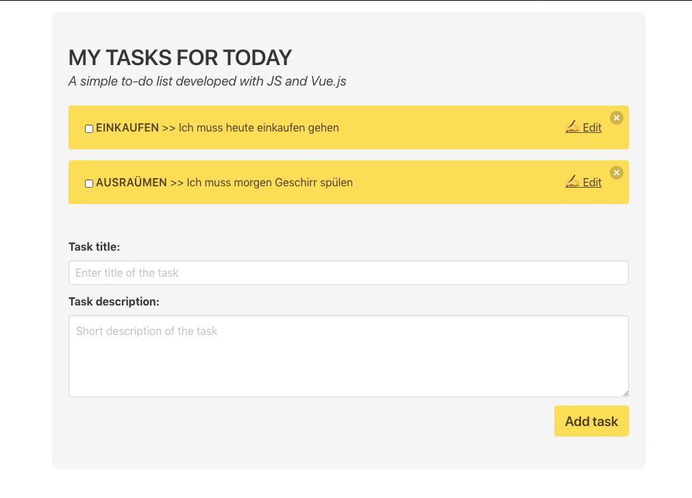

ToDo list developed with vanilla JS, Vue.js and Bulma.

## Install
Just open in the browser index.html. ~~Make sure third-party Cookies and data enabled in Chrome Browser.~~
Second option is to view it life at https://js-todo-list-hzekzsy0k.now.sh/

## Screenshot

