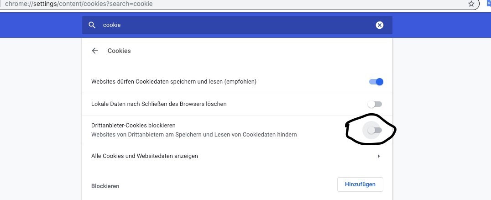

ToDo list developed with vanila JS and Vue.js

## Install
Just open in the browser index.html. Make sure third-party Cookies and data enabled in Chrome Browser.

Second option is to view it life at https://js-todo-list-7cuewmt7s.now.sh

## Screenshot

